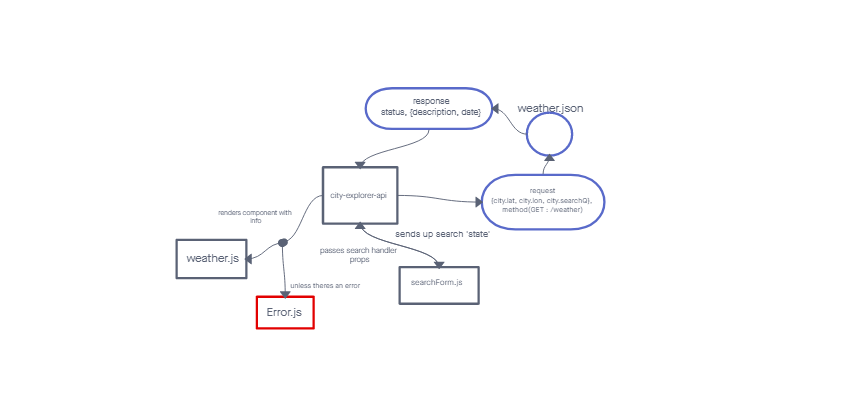
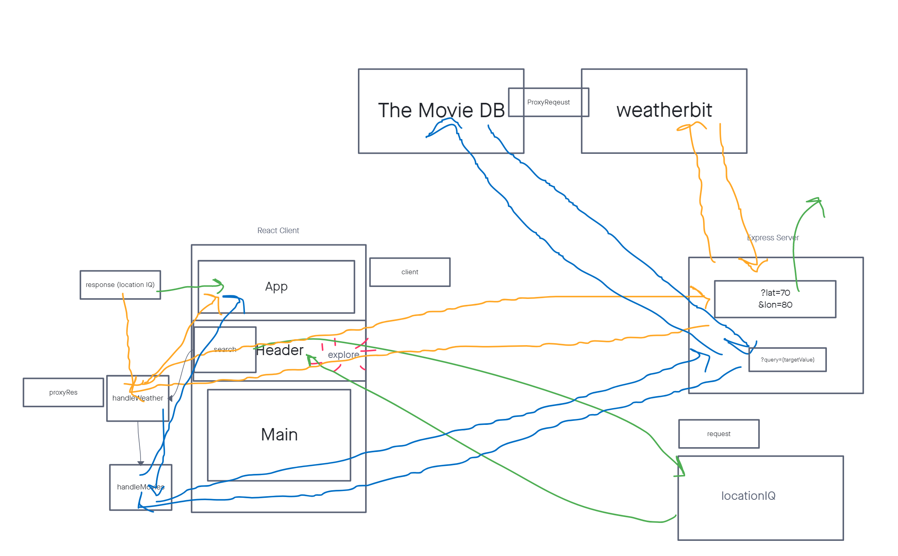

# city-explorer-api

**Author**: James Ian Ragasa Solima
**Version**: 1.0.0 (increment the patch/fix version number if you make more commits past your first submission)

## Overview

<!-- [Deployed Site](https://james-city-explorer.netlify.app/) -->

<!-- Provide a high level overview of what this application is and why you are building it, beyond the fact that it's an assignment for this class. (i.e. What's your problem domain?) -->

## Getting Started

Required packages:
- npm install react-bootstrap bootstrap
- npm install -g --force nodemon (sometimes the force is not needed)
- npm install express
- npm install cors
- npm install dotenv

Required APIs:
- [Weatherbits](https://www.weatherbit.io/)
- [TMDB](https://www.themoviedb.org/)
<!--  
[LocationIQ](https://locationiq.com/)
  -->
<!-- What are the steps that a user must take in order to build this app on their own machine and get it running? -->

## Architecture
>ver 1.0.0 
>
>
>ver 1.0.1 
> </a>

<!-- Provide a detailed description of the application design. What technologies (languages, libraries, etc) you're using, and any other relevant design information. -->

## Change Log

02-21-2023 Start: 1620 - Set up Server repo. Finish: 1629 Time: 9min 

02-21-2023 Start: 1910 - Created API endpoint in server and filter search functionality. Finish: 2210, Time: 3 hours

02-21-2023 Start: 2210 - Adds API calls to handle errors. Finish: 2213, Time: 3 min

02-22-2023 Start 1620 - Adds API calls to weatherbits and wires front end component to back end. Finish: 1750, Time: 1 hour 30 min

02-22-2023 Start 1910 - Created new API endpoint in server to to make API calls to TMDB API and return object to front end

02-22-2023 Start 2240 - Deployed this api to cloud server Finish: 2300, Time: 20 min

<!-- Use this area to document the iterative changes made to your application as each feature is successfully implemented. Use time stamps. Here's an example:

01-01-2001 4:59pm - Application now has a fully-functional express server, with a GET route for the location resource. -->

## Credit and Collaborations

>[Sheldon Pierce for Helping with the WRRC Diagram](https://github.com/Sheldon-Pierce)
<!-- Give credit (and a link) to other people or resources that helped you build this application. -->

